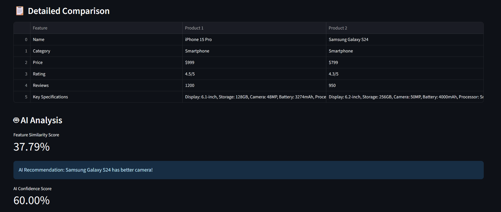
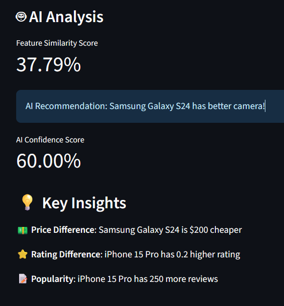

   # AI Product Comparator for Electronics
   
   ## Project Overview
   An intelligent web application that compares electronics products (like smartphones, laptops, etc.) based on **features**, **price**, **ratings**, and **specifications** using Natural Language Processing (TF-IDF + Cosine Similarity).. Built with Streamlit for the frontend and scikit-learn for AI features.
   
   ## Features
   - **Product Comparison**: Side-by-side comparison of two electronics products
   - **AI-Powered Analysis**: Uses TF-IDF and cosine similarity for feature comparison
   - **Smart Recommendations**: AI suggests better products based on multiple factors
   - **Filtering System**: Filter products by category and price range
   - **Interactive UI**: User-friendly Streamlit interface
   
   ## Technologies Used
   - **Frontend**: Streamlit
   - **Data Processing**: Pandas, NumPy
   - **AI/ML**: scikit-learn (TF-IDF, Cosine Similarity)
   - **Data Storage**: CSV file
   
   ## Installation & Setup
   1. Clone the repository: `[Repository](https://github.com/RayRenaissance/AI-Electronic-Comparator.git)`
   2. Install dependencies: `pip install -r requirements.txt` if encountered error while installing dependencies please update your pip `python -m pip install --upgrade pip`
   3. Run the application: `streamlit run app.py`
   4. Make sure your dataset is placed at: data/products.csv
   ### ⚠️ scikit-learn Installation Tip
      In case you face errors while installing the pinned version of scikit-learn, you may install the latest compatible version by running:
      pip install scikit-learn
      
## ✅ Pre-Launch Checklist

Before running the application, ensure:
- ✅ Python 3.8+ is installed
- ✅ All dependencies installed (`pip install -r requirements.txt`)
- ✅ Dataset exists at `data/products.csv`
- ✅ Dataset has all 6 required columns
- ✅ Port 8501 is available (or use `streamlit run app.py --server.port 8502`)

---
   
   ### Virtual Environment
   
   1. **Create virtual environment**
      ```bash
      python -m venv comparator_env
      
      # Activate it:
      # Windows:
      comparator_env\Scripts\activate
      # Mac/Linux:
      source comparator_env/bin/activate
      # Deactivate it:
      deactivate
   
   ## ⚙️ How to Run
   
   1. Clone the repository:
      ```bash
      git clone https://github.com/RayRenaissance/AI_Product_Comparator.git
      cd AI_Product_Comparator
   
   ## 📊 Dataset Setup

### Dataset Structure
The application uses a CSV file with the following structure:

```csv
name,category,price,specifications,rating,reviews
iPhone 15 Pro,Smartphone,999,"Display: 6.1-inch, Storage: 128GB, Camera: 48MP",4.5,1200
```

### Required Columns:
| Column | Type | Description |
|--------|------|-------------|
| `name` | String | Product name |
| `category` | String | Product category (Smartphone, Laptop, Headphones, etc.) |
| `price` | Number | Price in USD |
| `specifications` | String | Detailed product specifications |
| `rating` | Float | Rating out of 5.0 |
| `reviews` | Integer | Number of customer reviews |

### Setup Instructions:

1. **Create the data folder** (if not exists):
   ```bash
   mkdir data
   ```

2. **Place your dataset**:
   - File name: `products.csv`
   - Location: `data/products.csv`

3. **Sample Dataset**:
   - A sample dataset is included in the repository at `data/products.csv`
   - Contains 9 sample products across Smartphones, Laptops, Headphones, and Tablets

### Adding Your Own Products:

To add more products, simply edit `data/products.csv` following this format:

```csv
name,category,price,specifications,rating,reviews
"Your Product Name","Category",999,"Spec1: Value, Spec2: Value",4.5,1000
```

**Example:**
```csv
OnePlus 12,Smartphone,799,"Display: 6.7-inch, Storage: 256GB, Camera: 50MP, Battery: 5400mAh",4.4,850
```

### Dataset Path Configuration:

The default dataset path is hardcoded in `app.py`:
```python
DATA_PATH = 'data/products.csv'
```

To use a different path, modify this constant in `app.py`.

### Troubleshooting:

**Error: "Dataset not found"**
- Ensure `data/products.csv` exists
- Check the file path and spelling
- Make sure you're running the app from the project root directory

**Error: "Missing required columns"**
- Verify your CSV has all 6 required columns
- Check for typos in column names (case-sensitive)
- Ensure no spaces in column names

---

   
   ## Approach
   1. **Data Management**: CSV-based product database with structured specifications
   2. **NLP Processing**: TF-IDF vectorization of product specifications
   3. **Similarity Analysis**: Cosine similarity for feature comparison
   4. **Recommendation Engine**: Rule-based AI with weighted scoring system
   
   ## Challenges Faced
   1. **Specification Parsing**: Handling unstructured specification text
   2. **Similarity Measurement**: Creating meaningful comparison metrics
   3. **Recommendation Logic**: Balancing multiple factors (price, rating, features)
   4. **UI/UX Design**: Presenting complex comparisons in simple format
   
   ## Sample Output
   The application provides:
   - Side-by-side product comparison
   - Feature similarity scores
   - AI recommendations with confidence scores
   - Key insights and differences
   
   ## 🚀 Future Improvements
   
   - 🔍 **LLM Integration:**  
     Add a Large Language Model (like LLaMA, Mistral, or OpenAI GPT) to allow natural language queries such as  
     *“Compare the latest Samsung and OnePlus smartphones under ₹50,000.”*  
     The LLM will interpret user intent and select matching products automatically.
   
   - 📚 **RAG (Retrieval-Augmented Generation):**  
     Use a vector database (like FAISS or Chroma) to store and retrieve product specs dynamically.  
     The LLM can then generate comparison summaries backed by retrieved context for **factually accurate answers**.
   
   - 🛍️ **Smartphone Search & Dynamic Comparison:**  
     Let users type queries like:  
     *“Show me phones with 12GB RAM and 5000mAh battery.”*  
     Your system fetches relevant products from the dataset or web APIs and compares them automatically.
   
   - 🖼️ **Image-Based Comparison (Vision + LLM):**  
     Allow uploading product images and extract specs via OCR + vision models, then perform comparisons.
   
   - 🌐 **Real-time Data Integration:**  
     Connect APIs like Amazon Product API, Flipkart API, or GSM Arena scraping (free APIs available) to fetch live data — price, stock, and ratings — for up-to-date comparisons.
   
   - 🧠 **Explainable AI Insights:**  
     Show which specs/features contributed most to the AI’s recommendation (feature attribution visualization).
   
   ## 📸 Application Preview

   ### [Live Demo](https://ai-e-comparator.streamlit.app/)
   
   ### Product Comparison Interface
   
   
   ### AI-Powered Analysis & Recommendations
   
   
   ---

